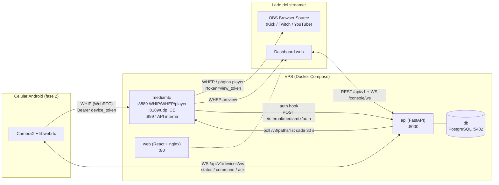

# OneVideo — Arquitectura

> Documento de visión técnica. La fuente de verdad de nombres, puertos, endpoints y campos
> es [CONTRACT.md](./CONTRACT.md); si algo difiere, gana el contrato.

## 1. Visión general

OneVideo convierte un celular Android en una cámara de streaming cloud. El celular publica
su cámara por WebRTC (WHIP) a un servidor de medios (MediaMTX) en un VPS; el streamer
consume ese video desde OBS como Browser Source con latencia sub-segundo, y controla el
celular (cámara on/off, frontal/trasera, calidad, linterna) desde un dashboard web sin
tocar el teléfono.

Hay dos planos bien separados:

- **Plano de medios**: celular → MediaMTX → OBS/dashboard. Video y audio en tiempo real.
  El backend nunca toca los bytes de video.
- **Plano de control**: celular ↔ API (WebSocket) y dashboard ↔ API (REST + WebSocket).
  Comandos, telemetría, autenticación, límites de plan.

Servicios Docker Compose (nombres exactos): `api`, `web`, `mediamtx`, `db`.
Dominios públicos: `app.${DOMAIN}` (web), `api.${DOMAIN}` (API), `stream.${DOMAIN}` (MediaMTX).

## 2. Flujos principales

### Publicación (celular → nube)
1. La app reclama un código de emparejamiento (`POST /api/v1/pairing/claim`) y recibe
   `device_token`, `whip_url` y `ws_url`.
2. Publica con `POST {STREAM_PUBLIC_URL}/live/<device_uuid>/whip` y header
   `Authorization: Bearer <device_token>`.
3. MediaMTX no valida nada por sí mismo: delega en el backend con
   `POST /internal/mediamtx/auth`. El backend verifica el hash sha256 del token contra el
   device del path y que el plan del dueño tenga horas disponibles. Si no, 401 y MediaMTX
   rechaza la publicación. Este hook es el punto único de enforcement de horas.

### Consumo (nube → OBS / dashboard)
- OBS usa la página player integrada de MediaMTX como Browser Source:
  `{STREAM_PUBLIC_URL}/live/<device_uuid>?token=<view_token>`. Cero instalación.
- El dashboard usa un cliente WHEP propio (~60 líneas: `RTCPeerConnection` + POST del SDP)
  contra `/live/<device_uuid>/whep?token=<view_token>`.
- El `view_token` viaja en query string; el auth hook lo extrae del campo `query` en la
  acción `read`. Es rotable desde el dashboard (`POST /devices/{id}/view-token/rotate`)
  porque una URL de OBS puede filtrarse en pantalla.

### Control (dashboard → celular)
1. El dashboard envía `POST /devices/{id}/commands` (REST, nunca por su WS).
2. El API lo reenvía por el WebSocket del dispositivo como `{type:"command", payload:{command_id, type, payload}}`.
3. El celular responde `ack` y el API empuja el nuevo estado a las consolas del dueño por
   `/api/v1/console/ws` (`device_status`).

La telemetría (batería, temperatura, red, bitrate) fluye en sentido inverso por el mismo
canal, cada pocos segundos, y se refleja en vivo en el dashboard.

### Medición de horas
Un tracker asyncio dentro del `api` consulta `GET {MEDIAMTX_API_URL}/v3/paths/list` cada
30 s. Path activo con `source != null` ⇒ sesión abierta en `stream_sessions`; al
desaparecer, se cierra. Las horas del período son la suma de duraciones del mes calendario.
Precisión de ±30 s por sesión: suficiente para límites mensuales, sin acoplarse a eventos
de MediaMTX.

## 3. Decisiones y porqués

### WHIP/WHEP (WebRTC) en vez de RTMP
- **Latencia**: WebRTC entrega 0.3–0.8 s de vidrio a vidrio. RTMP de ingesta más HLS/LL-HLS
  de salida son 2–10 s; incluso RTMP puro leído por OBS ronda 1–3 s. Para una cámara que el
  streamer usa en vivo junto a su facecam, cualquier desfase visible es descarte inmediato.
- **Cero instalación en OBS**: WHEP se consume con un Browser Source (la página player de
  MediaMTX). RTMP habría exigido que el usuario configure un Media Source con URL y buffer,
  o peor, un plugin.
- **NAT traversal integrado**: ICE/STUN vienen gratis con WebRTC. Con el VPS con IP pública
  (`PUBLIC_IP` para los candidatos ICE, UDP 8189) la mayoría de redes conecta directo;
  TURN queda como mejora futura para redes restrictivas (§6).
- **Costo aceptado**: WebRTC es más complejo de depurar que RTMP y depende de UDP. Lo
  asumimos porque la latencia es el producto.

### MediaMTX como servidor de medios (no reinventarlo en Python)
- Es un binario Go probado en producción, con WHIP, WHEP, página player, API de control
  (`:9997`) y hooks de autenticación externos — exactamente las piezas que necesitamos.
- Escribir SFU/relay propio (aiortc o similar) sería meses de trabajo para lograr algo
  peor: el manejo de jitter, congestión y codecs de un media server maduro no se replica
  en un MVP.
- La integración queda limpia: MediaMTX maneja bytes; nuestro backend decide *quién puede*
  (auth hook) y *cuánto usó* (poll de paths). Acoplamiento mínimo, reemplazable.

### PostgreSQL
- Datos relacionales claros (users, plans, devices, sessions), transacciones para
  emparejamiento de un solo uso, `JSONB` para settings/telemetría flexibles.
- Es el default aburrido y correcto; SQLite no sirve con varios workers y un documento DB
  no aporta nada aquí.

### Monolito modular en el MVP
- Un solo servicio FastAPI: REST, dos canales WS, auth hook interno y el tracker como tarea
  asyncio. Sin Celery, sin Redis, sin colas.
- A esta escala (cientos de dispositivos por nodo) todo cabe en un proceso; cada pieza
  extra de infraestructura es algo más que se rompe en el VPS de un indie.
- La modularidad interna (`app/api/v1`, `app/services`, `app/models`) deja los cortes
  listos para extraer piezas cuando duela, no antes.

## 4. Latencia esperada

Presupuesto típico celular → OBS, con el VPS razonablemente cerca (mismo continente):

| Etapa | Aporte |
|---|---|
| Captura + encode (hardware) en el celular | 30–80 ms |
| Red celular/WiFi → VPS | 20–120 ms |
| MediaMTX (relay, sin transcodificar) | < 10 ms |
| VPS → OBS + jitter buffer + decode | 60–200 ms |
| **Total vidrio a vidrio** | **~150–400 ms típico; < 800 ms en redes móviles flojas** |

Claves: no hay transcodificación en el servidor (el enforcement de calidad es cooperativo,
vía comando `set_quality`), y el jitter buffer de WebRTC se adapta solo. En 4G con señal
pobre la latencia sube y el bitrate adaptativo de la app la protege bajando calidad antes
que congelarse.

**Honestidad**: si el streamer está lejos del VPS (p. ej. VPS en Brasil, viewer en México),
la latencia sube linealmente con el RTT. La respuesta correcta es nodos regionales (§6),
no magia.

## 5. Seguridad (resumen)

- Usuarios: JWT HS256 (`SECRET_KEY`), bcrypt cost 12.
- Dispositivos: token opaco de 43 chars (`secrets.token_urlsafe(32)`), guardado hasheado
  (sha256). Se entrega una sola vez al emparejar; el pairing code (8 chars A-Z0-9) expira
  a los 15 min y es de un solo uso.
- Lectura de stream: `view_token` por dispositivo, rotable, independiente del JWT (OBS no
  puede autenticarse de otra forma).
- La API interna de MediaMTX (`:9997`) y Postgres nunca se exponen fuera de la red Docker.
- CORS restringido a `CORS_ORIGINS`.

## 6. Escalamiento futuro

En orden de necesidad real, no de moda:

1. **TURN (coturn)**: hoy dependemos de que UDP 8189 alcance el VPS. Redes corporativas,
   CGNAT agresivo o WiFi con firewall estricto fallan. Un TURN con TLS en 443 sube la
   conectividad a ~99 %. Es la primera inversión de infraestructura post-MVP (Roadmap fase 5).
2. **Varios nodos MediaMTX**: el cuello es ancho de banda del VPS, no CPU (no se
   transcodifica). Escalar es horizontal y simple: N nodos MediaMTX, cada `device` con un
   campo `node` asignado; la API entrega `whip_url`/`whep_url` del nodo correspondiente y
   el tracker consulta la API de cada nodo. Sin necesidad de mover streams entre nodos:
   publicador y lectores del mismo device siempre van al mismo nodo.
3. **Nodos regionales**: mismo mecanismo, asignando nodo por geografía del usuario
   (México, Brasil, Cono Sur) para bajar RTT.
4. **Separar el tracker / eventos de MediaMTX**: si el poll de 30 s queda corto a gran
   escala, migrar a los hooks de eventos de MediaMTX (runOnReady/runOnNotReady) o extraer
   el tracker a un worker.
5. **Grabación en la nube, transcodificación, simulcast**: solo si el producto lo pide;
   cada una convierte el relay barato en un servicio caro. No están en el MVP a propósito.

Lo que **no** vamos a hacer pronto: Kubernetes, microservicios, colas distribuidas. Un
Compose por nodo y una base Postgres central llegan mucho más lejos de lo que parece.
